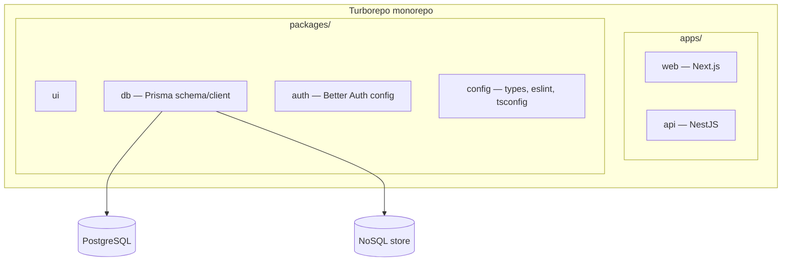
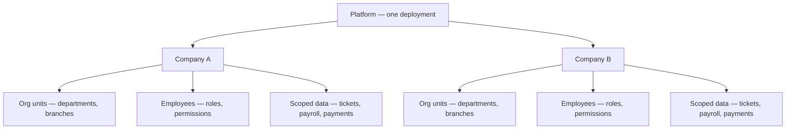
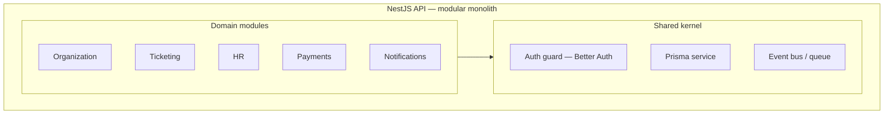
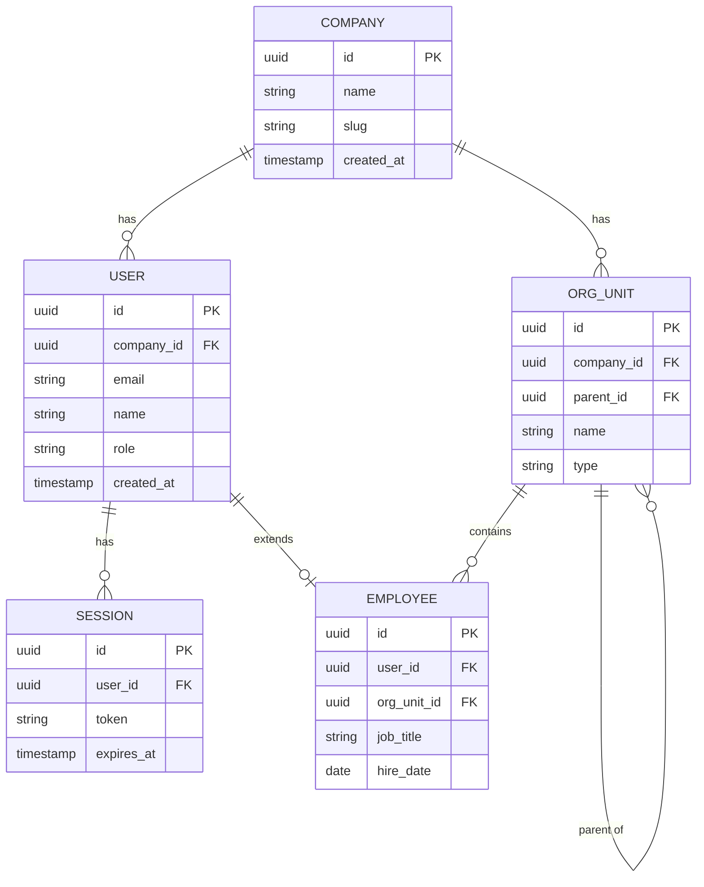
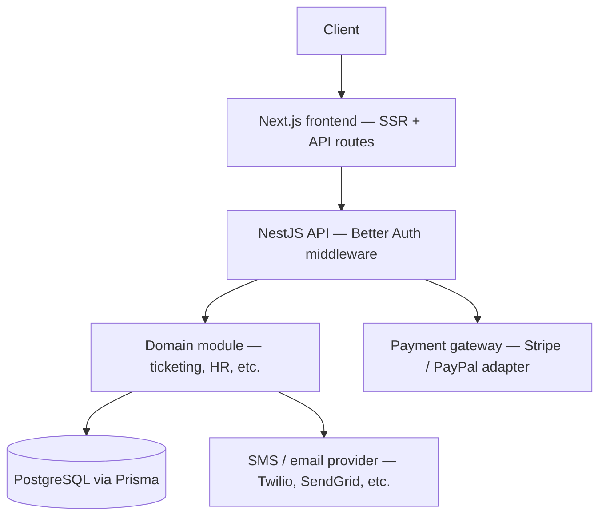
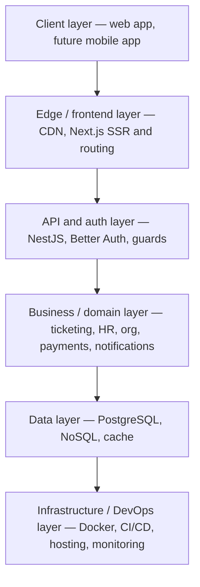
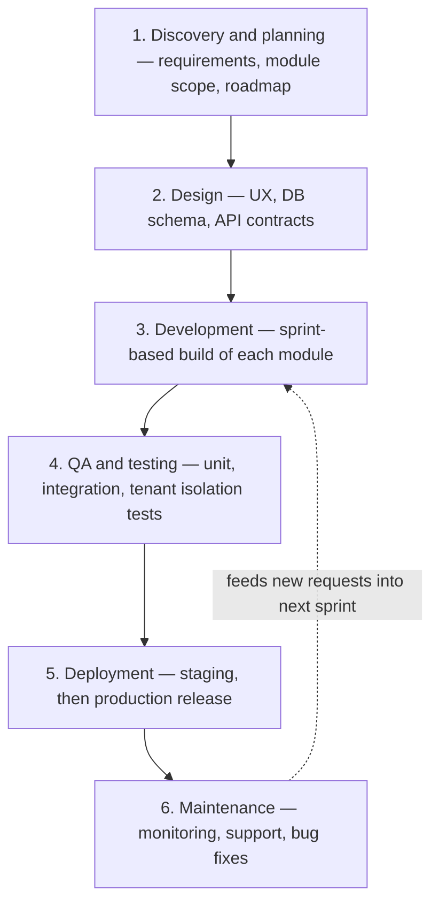
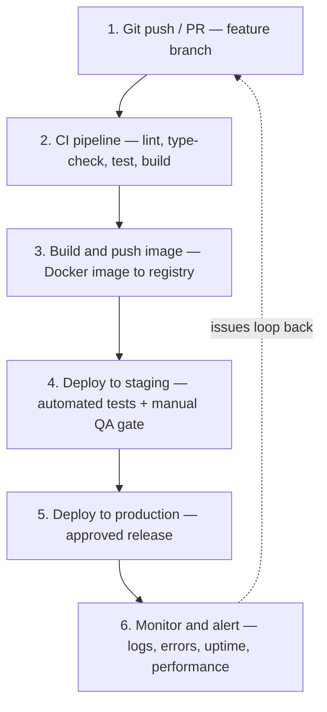
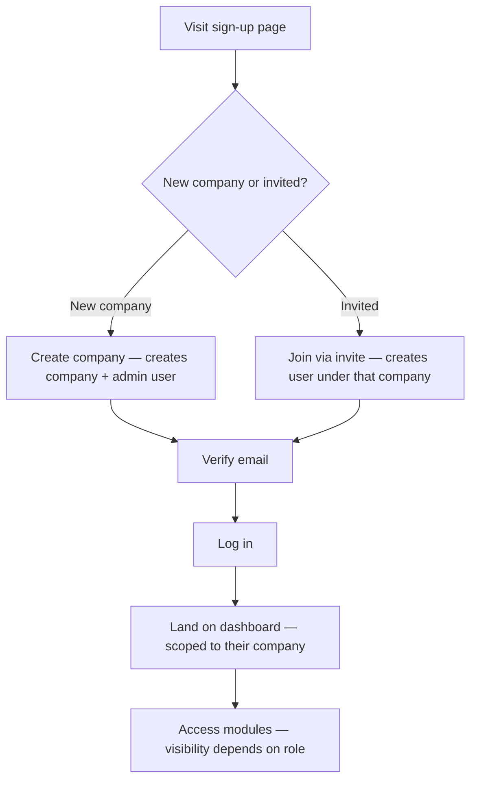

# ERP System — Architecture Documentation

## 1. Overview

A modular, multi-company ERP platform covering ticketing, HR, organizational management, payments, and notifications (SMS/email).

**Tech stack**

| Layer | Choice |
|---|---|
| Frontend | Next.js |
| Backend API | NestJS |
| Monorepo | Turborepo |
| Auth | Better Auth |
| Primary database | PostgreSQL via Prisma |
| Secondary store (optional) | NoSQL — logs, activity feed |

**Core architectural decisions**

- Modular monolith over microservices for the initial build
- Shared-database, shared-schema multi-tenancy, discriminated by `companyId`
- Each `User` belongs to exactly one `Company` (tenant); `Employee` is an optional extension of `User`, not a replacement
- Payment and notification providers implemented as adapters behind interfaces
- Event bus keeps domain modules decoupled (e.g. `ticket.created` → notification sent)
- Self-referencing org units for arbitrary hierarchy depth

**Module build order:** Organization → Auth → (Ticketing + HR in parallel) → (Payments + Notifications)

---

## 2. Monorepo structure



Folder layout:

```
erp/
├── apps/
│   ├── web/            # Next.js frontend
│   └── api/             # NestJS backend
├── packages/
│   ├── ui/               # shared React components
│   ├── db/               # Prisma schema + generated client
│   ├── auth/             # Better Auth config, shared session types
│   └── config/           # tsconfig, eslint, shared types
├── turbo.json
└── package.json
```

---

## 3. Multi-company (organizational) model



Every table below `Company` carries a `companyId` foreign key. A Prisma middleware or NestJS guard auto-injects that filter on every query, so one company can never see another's data. A single `User` can hold a `Membership` (with a role) in multiple companies.

---

## 4. Backend architecture (NestJS)



Modules communicate through the event bus, not direct calls — e.g. Ticketing emits `ticket.created`, Notifications listens and sends the SMS/email. This keeps modules independently testable and easy to extract into their own service later.

Folder layout (`apps/api`):

```
apps/api/
├── src/
│   ├── main.ts
│   ├── app.module.ts
│   ├── common/
│   │   ├── guards/           # Better Auth guard, roles/permissions guard
│   │   ├── decorators/        # @CurrentUser, @CurrentCompany
│   │   ├── interceptors/
│   │   ├── filters/
│   │   └── events/            # event bus setup, event contracts
│   ├── prisma/
│   │   └── prisma.service.ts  # tenant-scoped Prisma client
│   └── modules/
│       ├── organization/
│       │   ├── organization.module.ts
│       │   ├── organization.controller.ts
│       │   ├── organization.service.ts
│       │   └── dto/
│       ├── auth/
│       ├── ticketing/
│       │   ├── ticketing.module.ts
│       │   ├── ticketing.controller.ts
│       │   ├── ticketing.service.ts
│       │   └── dto/
│       ├── hr/
│       ├── payments/
│       │   ├── payments.module.ts
│       │   └── providers/
│       │       ├── stripe.provider.ts
│       │       └── paypal.provider.ts
│       └── notifications/
│           ├── notifications.module.ts
│           └── providers/
│               ├── twilio.provider.ts
│               └── sendgrid.provider.ts
├── test/
└── Dockerfile
```

---

## 5. Frontend architecture (Next.js)

Folder layout (`apps/web`), using the App Router with a company-scoped route segment:

```
apps/web/
├── app/
│   ├── (auth)/
│   │   ├── login/
│   │   └── register/
│   ├── (dashboard)/
│   │   ├── [companySlug]/
│   │   │   ├── tickets/
│   │   │   ├── hr/
│   │   │   ├── payments/
│   │   │   ├── settings/
│   │   │   └── layout.tsx     # resolves the user's company, provides context
│   │   └── layout.tsx          # auth-gated shell
│   ├── layout.tsx
│   └── page.tsx
├── components/                 # feature components, imports packages/ui
├── lib/
│   ├── auth-client.ts           # Better Auth client
│   ├── api-client.ts            # typed fetch wrapper to NestJS API
│   └── hooks/
├── middleware.ts                 # session check, redirect to login
└── next.config.js
```

Key conventions:
- Route segment `[companySlug]` reflects the tenant in the URL (e.g. `acme.yourapp.com` or `/acme/tickets`); since each user belongs to one company, the slug is derived directly from the session on login — there's no switcher.
- Server components fetch through `api-client.ts`, which attaches the session token to every request; the API resolves `companyId` from that session, not from client input.
- `middleware.ts` redirects unauthenticated requests to `/login`.

---

## 6. Entity relationship diagram — Organization & Auth foundation



Design notes:
- Each `USER` carries a `company_id` — one login, one tenant. This is straightforward SaaS multi-tenancy: different companies each use the software, but users don't hop between companies.
- `SESSION` is tied to `USER`; since a user only ever has one company, the tenant is implied the moment the session resolves — no per-request company switching logic needed.
- `ORG_UNIT` self-references (`parent_id`) for arbitrary hierarchy depth (company → division → department → team).
- `EMPLOYEE` optionally extends `USER` — not every user is an employee (e.g. contractors, external ticketing clients might just have a `role` without an `EMPLOYEE` record).

Every other module inherits this boundary: a `Ticket` gets a `company_id` (+ optional `org_unit_id`), an `Invoice` gets `company_id` + links to `EMPLOYEE`, a `Notification` gets `company_id` + `user_id`.

---

## 7. End-to-end request flow



---

## 8. Full technical stack (all layers)



---

## 9. Project delivery lifecycle



---

## 10. CI/CD pipeline



---

## 11. Sprint breakdown (2-week sprints, single team)

| Sprint | Focus | Output |
|---|---|---|
| 1–2 | Foundation | Turborepo setup, CI/CD skeleton, Better Auth wiring, Organization + Auth schema, tenant-aware signup/login flow |
| 3–4 | Ticketing | Ticket CRUD, status workflow, SLAs, assignment to org units |
| 5–6 | HR | Employee records, org unit assignment, payroll basics, leave management |
| 7 | Payments | Stripe/PayPal adapter, invoicing |
| 8 | Notifications | Twilio/SendGrid adapter, event bus wiring to Ticketing and Payments |
| 9 | Hardening & QA | Tenant isolation tests, security review, performance pass |
| 10–11 | Launch | Staging deploy, UAT, production release, monitoring setup |

Ticketing and HR (sprints 3–6) can run in parallel on separate workstreams if the team splits, compressing the timeline by roughly 2 sprints.

---

## 12. User onboarding and login workflow



- **New company path**: the first user to sign up for a company becomes its admin — this single action creates both the `Company` row and the first `User` row (role = admin).
- **Invited path**: an existing admin sends an invite (email + role); the invitee's sign-up creates a `User` scoped to that `company_id` with the role from the invite, not a fresh company.
- Since each `User` belongs to exactly one company, there's no company-switch step — the dashboard the user lands on is always their own.
- Module visibility is role-driven from here: an admin sees everything, an HR manager sees HR + org settings, an agent sees ticketing only, and so on — enforced by the same auth guard that already validates `company_id` on every request.

---

## 13. Next steps

- Confirm multi-tenancy isolation level (shared-schema vs schema-per-tenant) before finalizing the Prisma schema
- Define event contracts for the event bus (`ticket.created`, `invoice.paid`, etc.)
- Design the Ticketing and HR schemas in the same level of detail as the Organization/Auth ERD above
